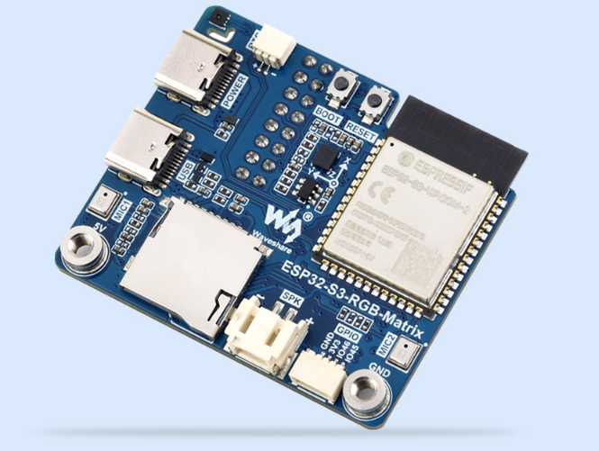

# Waveshare ESP32-S3-RGB-Matrix 产品工程示例程序 

[English](README.md) 

ESP32-S3-RGB-Matrix 是一款面向 HUB75 接口 RGB 点阵屏的高性能显示驱动板，搭载 ESP32-S3-N32R16 主控与大容量 Flash/PSRAM，板载 RTC、IMU、Micro SD 卡槽、低功耗音频编解码器、双麦克风等丰富外设资源，可同时满足多彩图形显示、语音交互和物联网应用等多种场景。 

- `https://www.waveshare.net/shop/ESP32-S3-RGB-Matrix.htm` 
- `https://docs.waveshare.net/ESP32-S3-RGB-Matrix/` 

--- 

## 🔧 配置 

您可以在 ESP32-S3-RGB-Matrix 的产品 Wiki 页面上找到详细的硬件资源说明、开发环境配置以及快速上手示例。 

--- 

## 🛠️ 贡献 

我们欢迎您的贡献！您可以通过以下方式提供帮助： 

1. Fork 本仓库。 
2. 为您的新功能或 Bug 修复创建一个新分支。 
3. 提交您的更改并附上清晰的描述。 
4. 提交 Pull Request 以供审核。 

--- 

## 🧩 问题与支持 

如果您遇到任何问题： 

- 请先查看 `https://gitee.com/waveshare/ESP32-S3-RGB-Matrix/issues` 版块。 
- 创建一个新的 Issue 并提供详细信息（现象、复现步骤、硬件环境等）。 
- 参考产品文档与示例程序获取故障排除提示。 
- 联系微雪团队并提供订单号以获取技术支持。 

--- 

## 📜 许可 

本仓库遵循 Apache License 许可。详情请参阅 [LICENSE](LICENSE) 文件。 

--- 

## 🙌 致谢 

- 感谢微雪电子提供的 ESP32-S3-RGB-Matrix 硬件平台和软件支持。 
- 感谢乐鑫团队的持续支持。 
- 感谢让这些项目成为可能的开源贡献者。 

--- 

感谢您使用 ESP32-S3-RGB-Matrix！🚀
